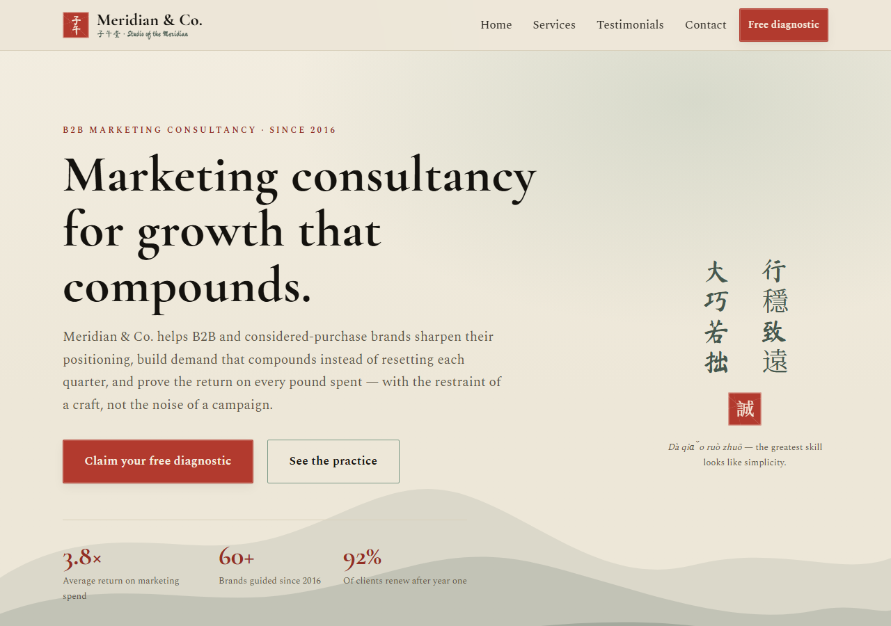
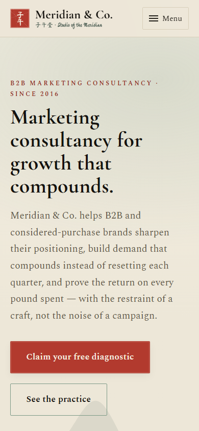

# Meridian &amp; Co. — Marketing Consultancy

A single-page marketing site built for a Claude Code class: static HTML, CSS and vanilla
JavaScript with **no frameworks, no build step, no package manager and no dependencies**
beyond Google Fonts.

The design is a **modern Song-dynasty** direction — Ru-ware celadon, cinnabar-seal red and
sumi ink on raw silk, with a vermilion scholar's seal as the signature motif. It doubles as
a lead-magnet page (a free "Growth Diagnostic" offer around the enquiry form) and carries
SEO scaffolding: JSON-LD structured data, Open Graph tags, a canonical URL, `robots.txt` and
`sitemap.xml`.

**Live:** https://clemhuang-sys.github.io/Vibe-Coding-Class-Claude-Code-25-Jul-2026/

> **Meridian &amp; Co. is fictional.** Every company detail, statistic and testimonial on the
> page — the "3.8× return", the "60+ brands", the three named clients — is invented
> placeholder copy written to fill the layout. Replace it before this is used for anything
> real.

## Screenshots

Captured from the live site with Playwright.

| Desktop — 1280×800 | Mobile — 390×844 |
|---|---|
|  |  |

## What's on the page

| Section | Contents |
|---|---|
| Sticky nav | Seal brand mark, anchor links, CTA; collapses to a toggle button below 48rem |
| Hero | Full-viewport headline, subheadline, two CTAs, three-stat proof strip, calligraphy signature |
| Services | Four disciplines (positioning, demand, brand, measurement) with hanzi glyphs |
| Lead magnet | Free "Growth Diagnostic" offer — what's-inside bullets, preview, social proof, enquiry form |
| Testimonials | Three sealed *colophons* in a responsive grid with a hover/focus lift |
| FAQ | Five objection-handling questions (also emitted as FAQPage structured data) |
| Footer | Contact link and back-to-top |

## Running it

There is no build and no server requirement — relative asset paths mean it works straight
off the filesystem.

```powershell
# Open it
start index.html

# Syntax-check the JS (the closest thing to a test suite here)
node --check script.js

# Only if something ever needs a real origin (nothing currently does)
python -m http.server 8000
```

Verification is manual: open the page, check it at 375 / 768 / 1280px, tab through it
without touching the mouse, and submit the form both empty and correctly filled in.

## Structure

Three files, strictly separated — markup, styling and behaviour never mix. No inline
styles, no inline event handlers.

```
index.html    markup only
styles.css    all styling — token-driven, mobile-first
script.js     all behaviour — nav toggle + form
CLAUDE.md     guidance for Claude Code sessions in this repo
screenshots/  README images, captured from the live site
.mcp.json     project-level MCP servers (Playwright, for browser automation)
```

**`styles.css`** builds everything from custom properties on `:root` — colour, spacing
(`--space-1`…`--space-6`), radius and shadow. A `prefers-color-scheme: dark` block
re-points those same variables, so anything built from tokens gets dark mode for free.
Every media query is `min-width`; the base styles are the phone layout. A
`prefers-reduced-motion` block disables transitions, animations and the card lift.

**`script.js`** is an IIFE loaded with `defer`, covering two independent concerns: the
mobile nav toggle and the enquiry form. Validation runs off a `rules` object keyed by
element id, and each rule's error text is written to the paragraph whose id is
`<fieldId>-error`. Adding a required field therefore means three coordinated edits — the
input, its matching error paragraph, and a rule function. A field with no rule entry is
treated as optional, which is why `company` validates silently.

## The form

The form is wired to Formspree but ships in **demo mode**. `FORMSPREE_ENDPOINT` at the top
of `script.js` still holds the `{YOUR_FORM_ID}` placeholder, so submitting logs the payload
to the browser console and makes no network request — a real POST to the placeholder URL
would 404 and make the form impossible to demo.

Because the site is deployed publicly, demo mode says so rather than faking success: there
is a standing notice above the fields, and submitting returns *"Demo mode — your message
was not sent."* Validation, the sending state and the error paths are all real; only the
delivery is absent. **Nothing typed into the live form reaches anyone.**

To go live, paste a real form ID from your Formspree dashboard:

```js
var FORMSPREE_ENDPOINT = 'https://formspree.io/f/xdorwvpk';
```

The `fetch()` path below the demo branch is already fully wired and takes over
automatically. Formspree form IDs are designed to be client-visible, so committing one is
expected rather than a leak.

## Deployment

Pushing to `main` deploys to GitHub Pages via
[`.github/workflows/deploy-pages.yml`](.github/workflows/deploy-pages.yml). Because the site
is static, the workflow has no build step — it uploads the repository as-is and hands the
artifact to Pages.

## Accessibility

The page ships with a skip link, landmark elements, `aria-labelledby` on every section,
`aria-expanded`/`aria-controls` on the nav toggle, `role="alert"` error paragraphs, an
`aria-live` status region, 48px minimum touch targets, visible `:focus-visible` rings, and
`aria-hidden` on decorative glyphs. Card hover lifts also fire on `:focus-within` so the
effect isn't mouse-only. Match this bar in new work.
